# Desafio EveryDrive 

## Estrutura (dados)
### Objetos e campos
- Padrão: `Account`, `Contact`
- Campos em `Account`:
  - `Customer_Tier__c` (Gold / Silver / Bronze)
  - `Number_of_Rentals__c`
  - `Total_Amount_Spent__c`
  - `Sales_Rep__c` (Lookup para `User`)
- Objeto customizado `Rental__c`:
  - `Account__c` (Lookup para Account)
  - `Start_Date__c`, `End_Date__c`
  - `Status__c` (Planejada, Em Andamento, Concluída/Completed, Cancelada)
  - `Value__c`

**(Setup → Object Manager → Rental__c):**
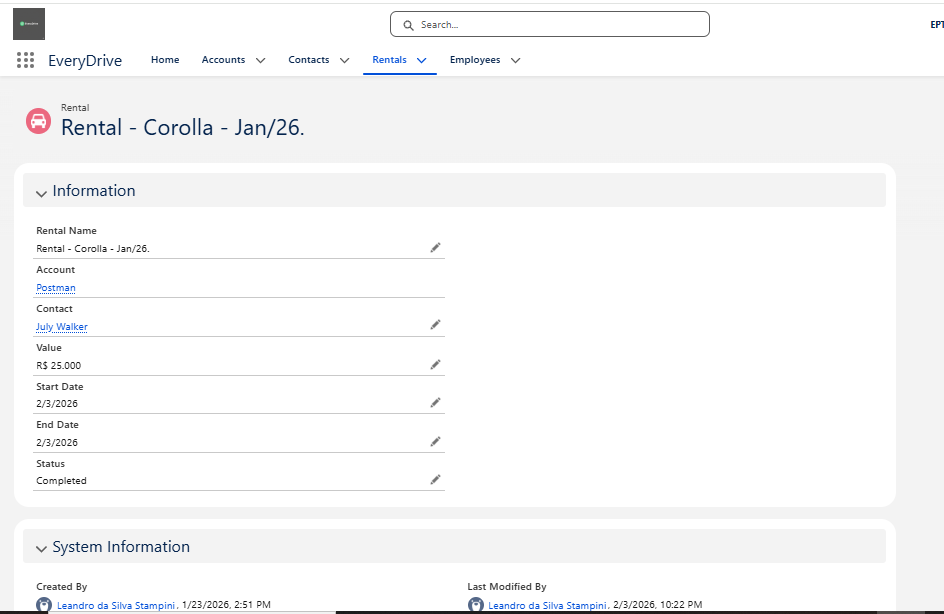


> Modelei o desafio usando `Account` como cliente, com campos de acompanhamento (tier, total gasto, qtd. locações e vendedor responsável). Para as locações, criei o objeto `Rental__c` com datas, status e valor, permitindo automações e validações de negócio.

---

## Automação (Flow)
Flow: **Account Customer Tier Flow** (Record-Triggered em `Account`, After Save)

### Regras
- Bronze: até 5.000
- Silver: 5.001 até 15.000
- Gold: acima de 15.000

### Critério “virou Gold”
- `$Record.Customer_Tier__c == Gold`
- `$Record__Prior.Customer_Tier__c != Gold`

### Ações
- Chatter post (Gold_Tier_Alert)
- Custom Notification para `Sales_Rep__c`

Observação importante:
- As notificações (chatter/sininho/e-mail) dependem do campo `Sales_Rep__c` estar preenchido no cliente com um usuário interno ativo.


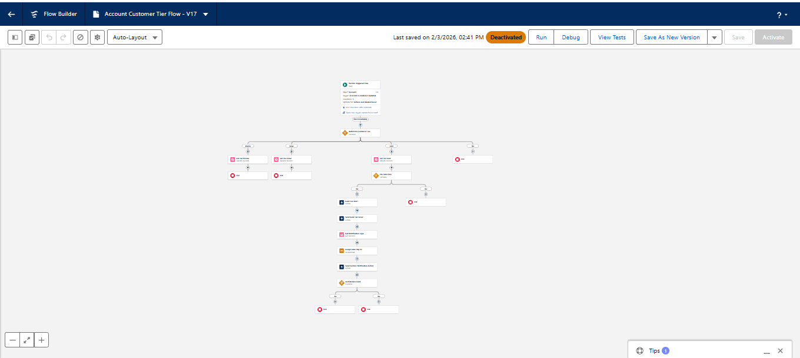


> O Flow classifica automaticamente o cliente em Bronze/Silver/Gold com base em `Total_Amount_Spent__c`. Quando há transição para Gold, o Flow dispara notificações (chatter + sino) para o vendedor responsável.

---

## LWC – Medalha por classificação
### Static Resource
Static Resource: **medals** (zip com `gold.png`, `silver.png`, `bronze.png`)

**(Setup → Static Resources):**
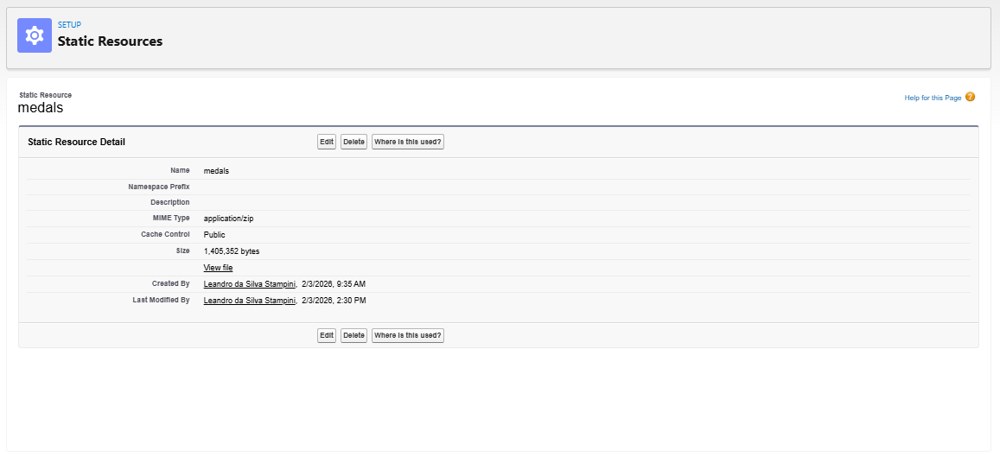

### Apex (Controller)
Arquivo: `force-app/main/default/classes/EveryDriveCustomerTierController.cls`

Trecho (mapeamento do tier → imagem):
```apex
String fileName = 'bronze.png';
if (normalizedTier == 'silver') fileName = 'silver.png';
if (normalizedTier == 'gold') fileName = 'gold.png';

return '/resource/medals/' + fileName;
```

### LWC
Arquivos:
- `force-app/main/default/lwc/everyDriveCustomerTierBadge/everyDriveCustomerTierBadge.html`
- `force-app/main/default/lwc/everyDriveCustomerTierBadge/everyDriveCustomerTierBadge.js`

Trecho (consumo Apex):
```js
import getTierImageUrl from '@salesforce/apex/EveryDriveCustomerTierController.getTierImageUrl';
import getAccountName from '@salesforce/apex/EveryDriveCustomerTierController.getAccountName';
import getCustomerTier from '@salesforce/apex/EveryDriveCustomerTierController.getCustomerTier';
```

### Publicação
- Adicionado na **Account Record Page** (App EveryDrive)

**(LWC renderizado na Account):**
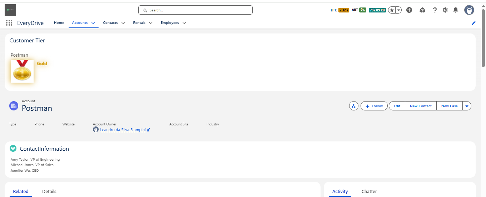


> Para evidenciar o tier visualmente, criei um LWC que consulta Apex para buscar nome/tier do cliente e monta a URL da imagem no Static Resource. Assim o componente fica leve e o mapeamento de tier (PT/EN) é centralizado.

---

## Trigger – Rental__c (validações + follow-up)
Trigger: `force-app/main/default/triggers/RentalTrigger.trigger`

Trecho (delegação para handler):
```apex
if (Trigger.isBefore) {
    RentalTriggerHandler.validateRentals(Trigger.new);
}

if (Trigger.isAfter && (Trigger.isInsert || Trigger.isUpdate)) {
    RentalTriggerHandler.createFollowUpTasks(Trigger.new, Trigger.oldMap);
}
```

Handler: `force-app/main/default/classes/RentalTriggerHandler.cls`

Regras implementadas:
- `Value__c > 0`
- `End_Date__c >= Start_Date__c`
- Status concluído exige `End_Date__c`
- Ao virar concluído, cria `Task` para `Sales_Rep__c` da `Account`

Observação importante:
- Se `Sales_Rep__c` estiver vazio ou apontar para usuário externo/guest, a Task não é criada para esse usuário.


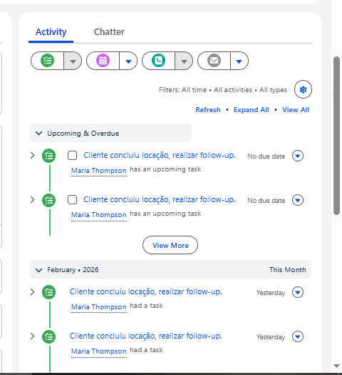


> A trigger de `Rental__c` valida dados antes de salvar (valor e consistência de datas) e, quando a locação muda para status concluído, cria automaticamente uma Task de follow-up para o vendedor responsável, garantindo ação proativa após a conclusão.

---

## Trigger – Account (e-mail quando vira Gold)
Trigger: `force-app/main/default/triggers/AccountTrigger.trigger`

Trecho:
```apex
if (Trigger.isAfter && Trigger.isUpdate) {
    AccountCustomerTierNotifier.handleAfterUpdate(Trigger.new, Trigger.oldMap);
}
```

Classe: `force-app/main/default/classes/AccountCustomerTierNotifier.cls`

Objetivo:
- Quando `Customer_Tier__c` muda para Gold, enviar e-mail para o vendedor (`Sales_Rep__c`)
- 
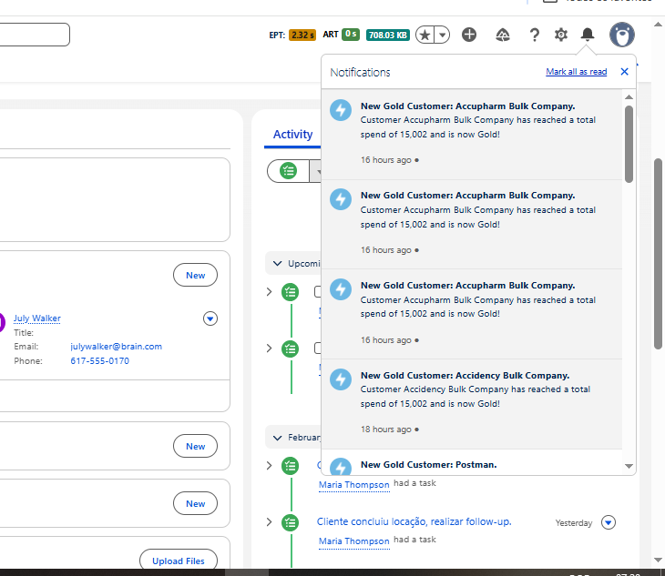
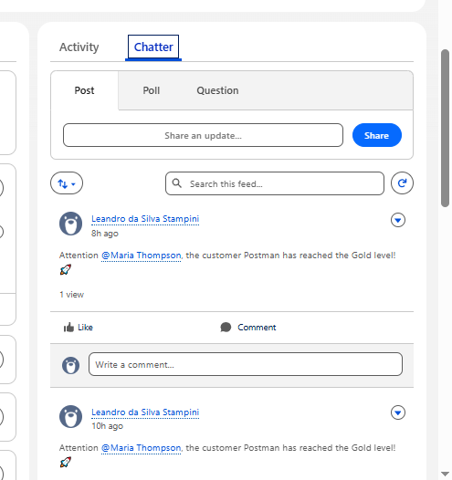


> Para notificar o vendedor em um marco importante, implementei uma trigger em `Account` que chama uma classe responsável por montar e enviar um e-mail quando o cliente atinge o tier Gold.

---

## Testes e Coverage (SF CLI)
### Test classes criadas
- `EveryDriveCustomerTierControllerTest`
- `AccountCustomerTierNotifierTest`
- `RentalTriggerHandlerTest`

Rodar testes do desafio (com coverage):
`sf apex run test --target-org everydrive --class-names EveryDriveCustomerTierControllerTest --class-names AccountCustomerTierNotifierTest --class-names RentalTriggerHandlerTest --result-format human --wait 60 --code-coverage`

Validate (check-only) do pacote do desafio:
`sf project deploy validate --target-org everydrive --source-dir force-app --test-level RunSpecifiedTests --tests EveryDriveCustomerTierControllerTest --tests AccountCustomerTierNotifierTest --tests RentalTriggerHandlerTest --wait 60`


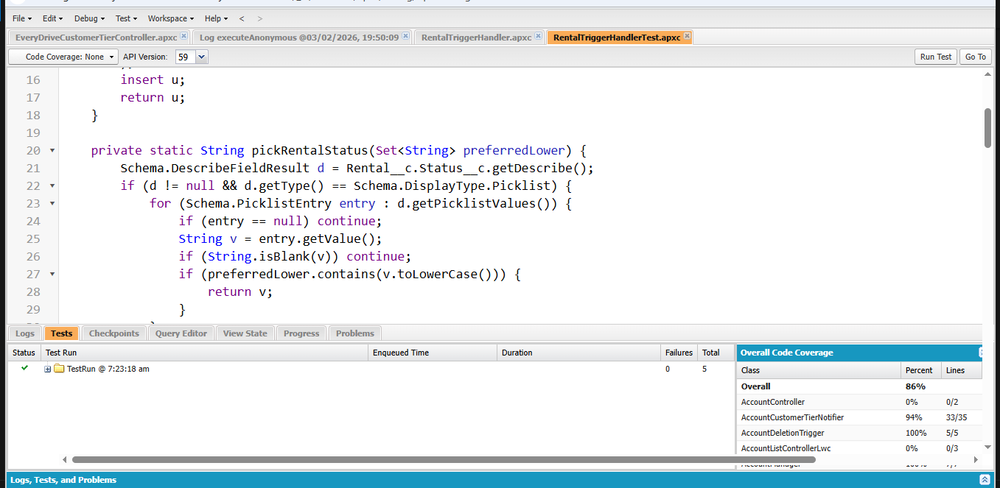


> Criei classes de teste cobrindo controller e triggers/handlers. Em seguida rodei testes com `--code-coverage` e validei o deploy em modo check-only com `RunSpecifiedTests`, garantindo que o pacote do desafio cumpre a regra mínima de 75%.

---

## Debug (Developer Console / Execute Anonymous)
Script de apoio (executado via Execute Anonymous ou `sf apex run`):
- `scripts/apex/debug_everydrive.apex`

**(Execution Log):**
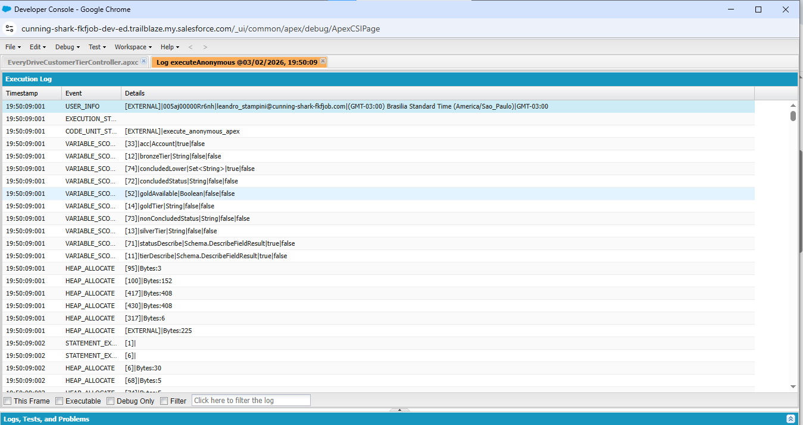


> Para evidenciar execução ponta-a-ponta, usei um script de debug que cria uma Account, chama os métodos da controller e realiza DML em `Rental__c` para disparar a trigger, confirmando via log a criação da Task de follow-up.

---

## Relatórios e Painéis (se aplicável)

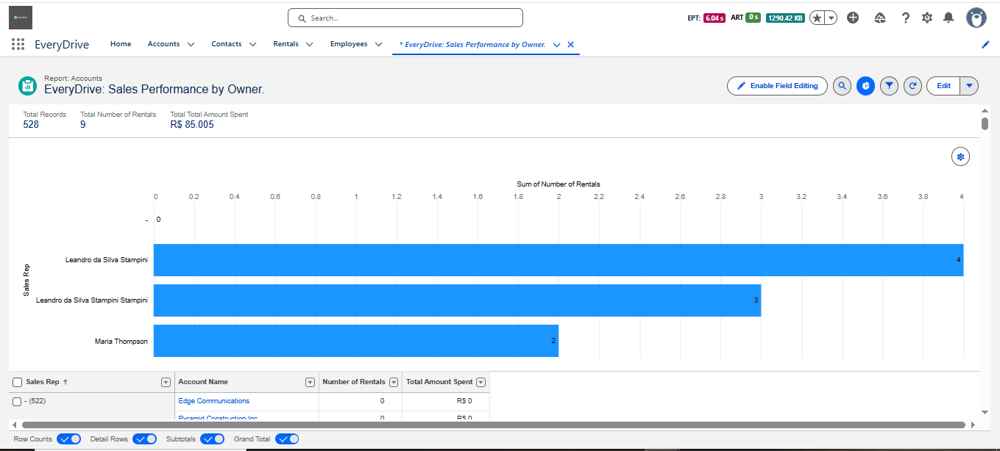
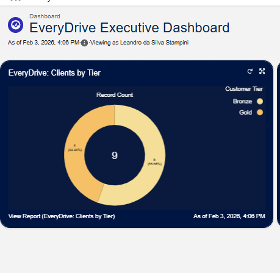


> Para acompanhamento gerencial, preparei (quando aplicável) um report de performance e um dashboard para visualizar distribuição por tier e resultados por vendedor.

---

## Reflexão (slide)
Mais fácil:
- Montar o LWC e integrar com Apex: a separação entre UI (LWC) e regras (Apex/Flow) deixou o componente simples e objetivo.
- Publicar a medalha na Account Record Page e validar visualmente o resultado (Static Resource + URL gerada no controller).
- Estruturar triggers no padrão “thin trigger + handler” (mais legível, fácil de testar e de evoluir).
- Rodar testes com `sf` CLI e obter relatórios de coverage rapidamente para evidenciar o requisito de 75%.

Mais desafiador:
- Garantir compatibilidade com picklists restritas (ex.: valores de `Status__c` e `Customer_Tier__c`) sem “hardcode” frágil; exigiu usar `Schema.describe` nos testes.
- Alinhar automações que dependem de dados do org (ex.: `Sales_Rep__c` preenchido, usuário interno ativo, deliverability de e-mail) para que Task + sininho + e-mail realmente apareçam.
- Validar deploy em org com “ruídos” externos (classes/testes inválidos que não fazem parte do desafio): foi necessário ajustar a estratégia de validação para `RunSpecifiedTests`.
- Cobertura de trigger/handler: além de testar o “caminho feliz”, precisei cobrir transições (insert vs update, mudança de status para concluído) e cenários inválidos.
- Debug ponta-a-ponta: comprovar execução entre Flow, triggers e LWC exigiu script de Execute Anonymous e leitura cuidadosa de logs.

Aprendizados / o que melhoraria:
- Normalizar o conceito de tier (ex.: “Gold/Ouro”) em um ponto único e reutilizável (ex.: Custom Metadata/Custom Label), evitando divergência entre Flow, Apex e UI.
- Tornar condições operacionais explícitas (ex.: fallback quando `Sales_Rep__c` estiver vazio, ou roteamento para `Account.OwnerId`/Queue) para não “silenciar” a criação de Task/avisos.
- Reduzir acoplamento do Flow com strings fixas (usar recursos/constantes) e adicionar validações/safeguards para quando dados essenciais não estiverem preenchidos.
- Evoluir a suíte de testes com mais cenários de borda (ex.: mudanças repetidas de status, múltiplas locações em lote, contas sem vendedor) e asserts mais descritivos.

---

## Planejamento (slide)
Estratégia (ordem):
1) Modelagem (objetos/campos)
2) Flow (automação de tier)
3) UI (LWC + Static Resource)
4) Triggers/Handlers (Rental + Account)
5) Testes, coverage e validate
6) Evidências (prints) + PDF

Ferramentas:
- VS Code + Salesforce Extensions
- `sf` CLI
- Developer Console (Execute Anonymous + Logs)
- Git (controle de versão local) para manter evolução incremental

Como me organizei (prática):
- Entregas pequenas e incrementais: após cada etapa (Flow, Apex, LWC), validei no org com um cenário simples.
- Testes junto com a implementação: sempre que criei/ajustei regra em Apex/trigger, adicionei teste cobrindo o cenário.
- Validação contínua: rodei `sf apex run test --code-coverage` para confirmar cobertura e usei `deploy validate` para simular a entrega.
- Evidências em paralelo: conforme cada funcionalidade ficava pronta, já separava os prints sugeridos no checklist.

Cronograma (exemplo, 3 dias):
- Dia 1 (base): modelagem de dados + Flow + primeiro ciclo de validação no org
- Dia 2 (feature): Apex (controller/handlers) + LWC + publicação na página + debug via Execute Anonymous
- Dia 3 (qualidade/entrega): testes (cobertura e cenários), `deploy validate`, coleta final de evidências e montagem do PDF

---

AI REVOLUTION COMPANY © Breathe in the *FUTURE AIRCOMPANY.AI*

Best Minds

2026


